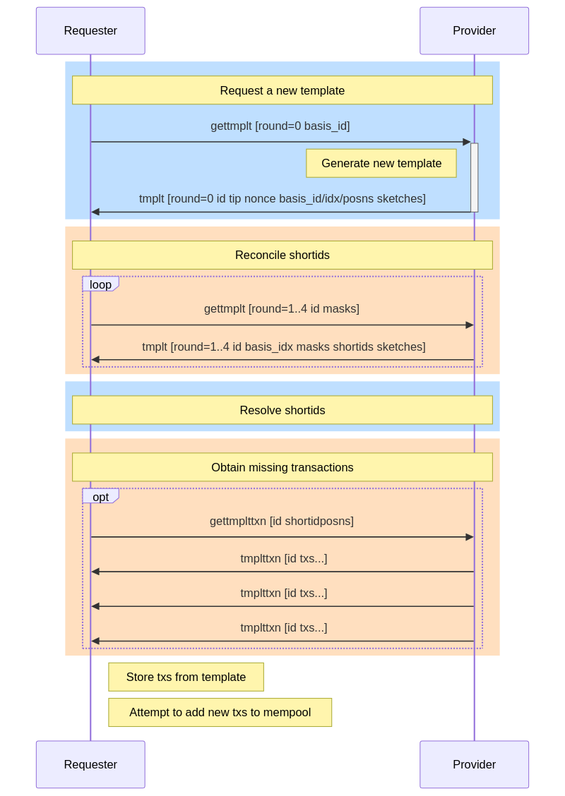

| BIN-2025-0002 | Sharing Block Templates with Peers
| :------------ | :-------
| Revision      | 004 (2026-08-28)
| Author        | Anthony Towns `<aj@erisian.com.au>`
| |
| Layer         | Peer Services
| Status        | Draft
| License       | BSD-3-Clause
| |
| Aliases       | [BIP-153](https://github.com/bitcoin/bips/pull/1937)

## Abstract

This proposal describes an efficient protocol for sharing block templates
(ie, the transaction a node predicts will be included in the next block)
with peers.

## Motivation

The benefits of sharing block templates with peers include:

 * improving the effectiveness of compact block reconstruction,
   particularly for nodes who have a more restrictive transaction relay
   policy than their peers;

 * allowing nodes that have not been online recently to quickly repopulate
   the top of their mempool;

 * providing a way for transactions to slowly propagate amongst nodes that
   will accept the transaction, even when those nodes are effectively
   isolated from each other for normal operation (due to primarily
   peering with nodes that have more restrictive relay policies); and

 * providing a way for transactions that may have dropped out of nodes'
   mempools to be rebroadcast across the network by third parties,
   potentially providing better privacy than if only the nodes directly
   involved in the transaction would rebroadcast it.

The protocol changes proposed here allow nodes to automatically share
templates in order to obtain those benefits.

## Concepts

This section introduces concepts specific to this proposal.

### Template

For the purposes of this BIP, a block template is an unordered collection
of transactions, limited to 8,000,000 weight units (ie, twice the
[BIP-141][BIP-141] block weight limit).

It is expected that transactions in a template are valid versus the
current chain tip (that is, they are consensus valid transactions, do
not have missing parents/ancestors, and do not conflict with other
transactions in the template).

Note that transactions in a template might not comply with the receiving
node's mempool or relay policy rules. In that case, the receiving node
will not add those transactions to the mempool, nor relay them; but
preserving them despite that is what allows shared templates to improve
compact block relay.

Templates can be identified via a **template id** (analogous to a block
hash or a txid), which is a hash based on the current block tip and the
wtxids of the txs in the template.

Note that while this is similar to the block template generated by
`getblocktemplate` it differs in several key aspects: there is no coinbase
transaction, it has a higher weight limit, and is unordered.

### Protocol Flow

Obtaining a template from a peer consists of four major phases:

 * Requesting a new template
 * Reconciling the set of transactions in the template as a set of shortids
 * Resolving the shortids against already available transactions
 * Requesting missing transactions

Once obtained, the set of transactions in a template can be used however
a node wishes, eg for faster compact block relay, as an additional means
of transaction relay, or for analysis and observation.

### 46-bit Short transaction ids (shortids)

To save bandwidth, we use 46-bit shortids to identify transactions.

These are similar to the 32-bit shortids introduced for transaction
reconciliation in [BIP-330][BIP-330], and the 48-bit shortids introduced
for compact block relay in [BIP-152][BIP-152]. The 46-bit size is chosen
because the collision resistance needed for template reconstruction is
similar to that of block reconstruction: it applies against the whole
mempool (or at least the top of the mempool), rather than only recently
relayed transaction. It is slightly smaller in size (reduced to 46-bits
and excluding the value 0) in order to be better optimised for resolution
via minisketch.

Because finding collisions in a 46-bit domain is relatively easy,
shortids use a keyed hash, with the key constructed based on the
chain tip hash, and a randomized nonce chosen by the template
constructor[^shortid-collisions].

This approach is fairly similar to that of BIP-152 compact block relay:
checking to see if you already have the transactions in a template by
shortid is a fairly quick scan across the existing mempool.

In addition, the shortid values are used to provide the transaction
ordering where ordering is necessary, such as for calculating the
template id.

### Shortid Reconciliation Overview

Template sharing is more frequent than compact block relay, because
templates are shared multiple times during the average block interval,
and because templates are shared by many peers, not just the first peer
to see a new block. In addition, templates will generally contain twice
as many transactions as a block. As a result, rather than simply listing
the shortids of a template in a similar way to [BIP-152][BIP-152]'s list
of shortids in a compact block, we take two additional steps to reduce
the bandwidth needed to determine a template's shortids.

The first of these is basis reconciliation. Because templates are frequent,
they will often be very similar. To take advantage of this, nodes can use
the previous template they received from a peer as the basis for a new template,
receiving an efficiently encoded indication of which transactions from the
old template are also in the new template.

The second step is using minisketch reconciliation to reduce the bandwidth
further, for cases where the receiver is able to make a good prediction
of which remaining transactions are needed: a minisketch of 368 bytes is
able to correct an error in the estimate of 64 shortids, and we send up
to 32 such minisketches across multiple rounds, to efficiently correct
an error of up to 2048 shortids.

If reconciliation via the basis and minisketches do not suffice, an
explicit list of shortids is sent that combined with the basis and
minisketches is enough to recover the full set of shortids.

### Transaction Sync

Once the template's shortids are known, they can be matched to
transactions the node already has. In many cases, this will fully
recover all transactions in the template, and no further transaction
sync is needed.

In cases where some transactions are not known, we request those
transactions from the peer that sent the template. We do this by first
sorting the shortids to get a canonical ordering of transactions in the
template, then requesting missing transactions by their positions in
that ordering.

### Template Validation

Once we have all the txs for the template, we calculate the template
hash, using the provided tip block hash, and the transactions' wtxids,
ordering the transactions via their shortids.

If the calculated hash differs from the template id, that indicates
a reconstruction error (perhaps an undetected shortid collision, or
perhaps just bad data from the peer), and the attempt to share the
template has failed.

Since template sharing is non-essential, failures can be dealt with in
a variety of ways:

 * preserve whatever new txs were obtained and process them as normal
 * ignore the failure and retry later
 * for protocol violations, stop requesting/sending templates, or
   disconnect or ban the peer.

## Specification

### Messages

The protocol flow described above is enabled by four new messages,
used across the phases as follows:

 * Requesting a new template (round 0 `gettmplt`, `tmplt`)
 * Reconciling the template shortids (round 1..4 `gettmplt`, `tmplt`)
 * Resolving the shortids against the mempool and other templates
 * Obtaining missing transactions (`gettmplttxn`, `tmplttxn`)



#### The `gettmplt` message

The payload of the `gettmplt` message contains the following data for round 0:

| Type        | Name         | Description |
| ----------- | ------------ | ----------- |
| `uint8_t`   | `round`      | Round identifier (0) |
| `uint256`   | `basis_id`   | Template id of a previous template from this peer to use as a basis (optional) |

If provided, the `basis_id` SHOULD be the hash of a prior template
from this peer that was previously fully resolved.

The payload of the `gettmplt` message contains the following data for rounds 1-4:

| Type        | Name           | Description |
| ----------- | -------------- | ----------- |
| `uint8_t`   | `round`        | Round identifier (1, 2, 3, or 4) |
| `uint256`   | `template_id`  | The template id |
| `uint8_t`   | `basis_idx`    | The index of the basis, or zero |
| `uint32_t`  | `shortid_mask` | Groups to send shortids for |
| `uint32_t`  | `sketch_mask`  | Groups to send sketches for |

A `gettmplt` message with `round` greater than zero MUST NOT be sent
except in response to a `tmplt` message that specified the same template
id and the immediately prior round.

The `basis_idx` MUST be the value provided by the peer in the round 0
`tmplt` message.

The values in `shortid_mask` and `sketch_mask` indicate the groups for
which sketches or shortids should be sent. For round `r`, there are
`g=2**(r+1)` groups available, so both masks MUST NOT have any bit other
than the lowest `g` bits set, that is both masks MUST have a value less
than `2**g`.

The intersection between the two masks MUST be empty (ie `sketch_mask &
shortid_mask == 0`). That is, a `gettmplt` MUST choose whether to resolve
a group by either sketch or shortids, but not both.

In round 4, `sketch_mask` MUST be zero, as there are no additional
sketches available.

The requesting node MAY freely choose to resolve a group by requesting
an additional sketch or shortids.

If the requesting node is able to resolve a group's shortids with existing
information, it SHOULD clear the corresponding bit in both masks.

A `gettmplt` message with both `shortid_mask` and `sketch_mask` set to
0 MUST NOT be sent.

#### The `tmplt` message

The payload of the `tmplt` message contains the following data for round 0:

| Type          | Name          | Description |
| ------------- | ------------- | ----------- |
| `uint8_t`     | `round`       | Round identifier (0) |
| `uint256`     | `template_id` | The template id |
| `uint256`     | `tip_hash`    | Block hash of the tip at the time the template was generated |
| `uint64_t`    | `nonce`       | Template-level nonce for shortid computation |
| `uint256`     | `basis_id`    | Template id of the basis specified in the `gettmplt` message, or zero |
| `uint8_t`     | `basis_idx`   | The index of the basis, or zero |
| `gr_vec`      | `basis_posns` | GR-encoded positions of transactions retained from the basis template |
| sketch vector | `sketches`    | Four stride-4 sketches of transactions in the template |

If `basis_id` is non-zero, `basis_id` MUST match the value provided in
the `gettmplt` message, and `basis_idx` MUST be set to a non-zero that
can be used to identify the same basis in future `gettmplt` messages. If
`basis_id` is zero, `basis_idx` MUST also be zero.

`basis_posns` MUST be empty if `basis_id` is zero. If
`basis_posns` is non-empty, each of the transactions referenced from
the basis template MUST be present in this template.

The payload of the `tmplt` message contains the following data for rounds 1-4:

| Type          | Name           | Description |
| ------------- | -------------- | ----------- |
| `uint8_t`     | `round`        | Round identifier (1, 2, 3 or 4) |
| `uint256`     | `template_id`  | The template id |
| `uint8_t`     | `basis_idx`    | The index of the basis, or zero |
| `uint32_t`    | `shortid_mask` | Groups for which shortids were requested |
| `uint32_t`    | `sketch_mask`  | Groups for which sketches were requested |
| `gr_vec`      | `shortids`     | GR-encoded shortids in requested groups |
| sketch vector | `sketches`     | Requested additional sketches of transactions in the template |

For rounds 1-4, the `basis_idx`, `template_id`, `shortid_mask`, and
`sketch_mask` MUST match the corresponding values in the `gettmplt`
message being replied to.

The `shortids` field contains the GR-encoded shortids for the groups
specified in `shortid_mask`. The `sketches` field contains a vector of
sketches for the groups specified in `sketch_mask`. These are described
in more detail in the Encodings section below.

A `tmplt` message MUST NOT be sent except in response to a `gettmplt`
message, and MUST match the round specified in the `gettmplt` message.

#### `gettmplttxn` message

The payload of the `gettmplttxn` message contains the following data:

| Type          | Name           | Description |
| ------------- | -------------- | ----------- |
| `uint256`     | `template_id`  | The template id |
| `gr_vec`      | `tx_posns`     | GR-encoded positions of requested template transactions |

#### `tmplttxn` message

The payload of the `tmplttxn` message contains the following data:

| Type          | Name           | Description |
| ------------- | -------------- | ----------- |
| `uint256`     | `template_id`  | The template id |
| tx vector     | `txs`          | Vector of requested transactions |

The `txs` provided MUST match the transactions specified in a prior
`gettmplttxn` message, and MUST be provided in order.

Transactions SHOULD be split across multiple `tmplttxn` messages,
keeping each message to roughly 100kB in size where possible (so if
a single transaction in the template is larger than 100kB serialized,
it should be sent on its own).

When the requested transactions are split across multiple `tmplttxn`
messages, there SHOULD be a small delay between sending each message,
allowing higher priority messages (such as new block announcements)
to be interleaved.

### Encodings

#### Block Hashes

Block hashes are encoded as the direct output of the double-SHA256 hash
of the header as usual. Note that this is reversed (or in little-endian
format) compared to the usual representation with leading zeroes that
is used for display.

#### Short Transaction IDs

Shortids are constructed using [SipHash-1-3-UJ][SipHash13UJ][^shortid-siphash13uj] as follows:

 * Calculate the sha256 hash of the tip block hash that the template is
   built against, followed by the nonce as a 64-bit little-endian number.
 * Initialize the hasher with `k0` and `k1` set to the first two 64-bit
   little-endian integers from that hash.
 * Provide the transaction's wtxid as a 256-bit jumbo input to the hash,
   then finalize, giving a 64-bit integer.
 * Calculate `(h >> 18) + (((h & 0x3ffff) << 46) >= h)` to convert that
   value to a non-zero 46-bit integer[^shortid-nonzero].

That is:

```python
def sha256(s):
    return hashlib.sha256(s).digest()

tip_hash = sha256( sha256(tip_header) )
seed = sha256( tip_hash + nonce.to_bytes(8, "little") )
k0 = int.from_bytes(seed[0:8], "little")
k1 = int.from_bytes(seed[8:16], "little")

wtxid = sha256( sha256(tx_with_witness) )
h = siphash13uj(k0, k1, wtxid)
h46 = (h >> 18) + (((h & 0x3ffff) << 46) >= h)
```

#### Minisketch Sketch Tree

#### Sketch Serialization

#### GR Encoding for Missing Positions

#### Mask Serialization

### Feature Negotiation

#### Feature Negotiation

TODO - BIP-434 featureid / featuredata

## Usage

TODO

## Privacy Considerations

TODO

## Operational Considerations

TODO

## Test Vectors

TODO

## Backward Compatibility

This protocol uses [BIP-434][BIP-434] feature negotiation, so clients that
specify a protocol version older than 70017 will not see any messages
related to this feature, and clients that implement BIP-434 but do not
support this feature will only see the feature announcement message,
which BIP-434 requires they accept and ignore.

## Supplementary

### Acknowledgements

Thanks to Gregory Sanders who made a similar proposal around [compact
weak blocks][Sanders24] which was the inspiration for this.

### Copyright

This document is licensed under the 3-clause BSD license.

### References

[BIP-141]: https://github.com/bitcoin/bips/blob/master/bip-0141.mediawiki
[BIP-152]: https://github.com/bitcoin/bips/blob/master/bip-0152.mediawiki
[BIP-330]: https://github.com/bitcoin/bips/blob/master/bip-0330.mediawiki
[BIP-434]: https://github.com/bitcoin/bips/blob/master/bip-0434.md
[Sanders24]: https://delvingbitcoin.org/t/second-look-at-weak-blocks/805
[SipHash13UJ]: https://delvingbitcoin.org/t/faster-txid-hash-tables-with-siphash-1-3-uj/2834
## Rationale

[^shortid-collisions]: The main concern with shortid collisions is not
that a template constructor will make collisions (if they want to prevent
you from reconstructing their own templates, they could simply send
garbage templates or not send templates at all), but rather to prevent a
third party from constructing transactions that will predictably collide
with the shortids of existing transactions.

[^shortid-siphash13uj]: We choose SipHash-1-3-UJ rather than SipHash-2-4
as specified for compact blocks by [BIP-152][BIP-152] for the standard
reasons (see [SipHash-1-3-UJ][SipHash13UJ]): we only need to avoid
collisions, not simulate true randomness; the inputs we are using are
256-bit cryptographic hashes; and, since we are likely to rehash the wtxid
of every transaction in the mempool every time we receive a template,
making this faster is valuable.

[^shortid-nonzero]: Minisketch requires elements in the sets it reconciles
be non-zero, so when reducing the range from 64-bits to 46-bits, we
apply an adjustment that avoids that value without adding a bias.
